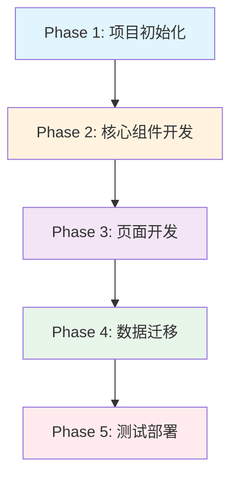

# 开发阶段总览文档

**版本**: 1.0  
**日期**: 2026-03-21  
**项目**: 湖南盛通达材料科技官网 - 全面重写  
**开发周期**: 12 周

---

## 📅 开发阶段划分

### 阶段总览

```
Week 1-3   │████████░░░░░░░░░░░░│ Phase 1: 项目初始化
Week 4-6   │░░░░░░████████░░░░░░│ Phase 2: 核心组件开发
Week 7-9   │░░░░░░░░░░░░████████│ Phase 3: 页面开发
Week 10-11 │░░░░░░░░░░░░░░░░████│ Phase 4: 数据迁移
Week 12    │░░░░░░░░░░░░░░░░░░░█│ Phase 5: 测试部署
```

---

## 🎯 Phase 1: 项目初始化 (Week 1-3)

### 目标
搭建完整的项目基础设施，为后续开发提供标准化环境。

### 核心任务

#### Week 1: Monorepo 架构搭建
- [ ] 创建 pnpm workspace 配置
- [ ] 配置 Turborepo 构建系统
- [ ] 设置包管理器约束
- [ ] 配置 TypeScript 项目引用
- [ ] 建立 ESLint + Prettier 代码规范
- [ ] 配置 Husky + lint-staged Git 钩子

**详细说明**: [`PHASE_1_WEEK_1.md`](./PHASE_1_WEEK_1.md)

#### Week 2: 技术栈配置
- [ ] 安装 React 19 + Vite 8
- [ ] 配置 Tailwind CSS 4
- [ ] 集成 shadcn/ui 组件库
- [ ] 配置 React Router 7
- [ ] 设置 MongoDB + Mongoose
- [ ] 配置 Express 服务器

**详细说明**: [`PHASE_1_WEEK_2.md`](./PHASE_1_WEEK_2.md)

#### Week 3: 开发环境完善
- [ ] 配置环境变量管理
- [ ] 设置 Docker 开发环境
- [ ] 配置热更新 (HMR)
- [ ] 建立 Mock 数据系统
- [ ] 配置路径别名
- [ ] 设置绝对路径导入

**详细说明**: [`PHASE_1_WEEK_3.md`](./PHASE_1_WEEK_3.md)

### 交付物
- ✅ 可运行的 Monorepo 项目骨架
- ✅ 完整的开发工具链
- ✅ 代码规范检查系统
- ✅ 基础 CI/CD 配置

---

## 🎯 Phase 2: 核心组件开发 (Week 4-6)

### 目标
开发可复用的基础组件库，建立设计系统。

### 核心任务

#### Week 4: 设计系统实现
- [ ] 创建 Design Tokens 系统
- [ ] 实现色彩系统组件
- [ ] 实现字体排印系统
- [ ] 实现间距系统组件
- [ ] 实现阴影系统组件
- [ ] 实现圆角系统组件

**详细说明**: [`PHASE_2_WEEK_4.md`](./PHASE_2_WEEK_4.md)

#### Week 5: 基础组件开发
- [ ] Button 组件 (5 种变体)
- [ ] Input 组件 (3 种尺寸)
- [ ] Card 组件 (4 种样式)
- [ ] Navigation 组件 (响应式)
- [ ] Footer 组件
- [ ] Loading 组件

**详细说明**: [`PHASE_2_WEEK_5.md`](./PHASE_2_WEEK_5.md)

#### Week 6: 业务组件开发
- [ ] ProductCard 组件
- [ ] ProductGrid 组件
- [ ] FilterPanel 组件
- [ ] SearchBox 组件
- [ ] InquiryForm 组件
- [ ] Breadcrumb 组件

**详细说明**: [`PHASE_2_WEEK_6.md`](./PHASE_2_WEEK_6.md)

### 交付物
- ✅ 完整的设计系统
- ✅ 30+ 可复用组件
- ✅ 组件文档站点
- ✅ 组件测试用例

---

## 🎯 Phase 3: 页面开发 (Week 7-9)

### 目标
完成所有前端页面的开发和集成。

### 核心任务

#### Week 7: 核心页面开发
- [ ] 首页 (Home Page)
- [ ] 产品目录页 (Product Catalog)
- [ ] 产品详情页 (Product Detail)
- [ ] 404 页面
- [ ] Loading 页面

**详细说明**: [`PHASE_3_WEEK_7.md`](./PHASE_3_WEEK_7.md)

#### Week 8: 内容页面开发
- [ ] 关于我们页 (About Us)
- [ ] 新闻中心页 (News List)
- [ ] 新闻详情页 (News Detail)
- [ ] 联系我们页 (Contact)
- [ ] 应用案例页 (Applications)

**详细说明**: [`PHASE_3_WEEK_8.md`](./PHASE_3_WEEK_8.md)

#### Week 9: 功能页面开发
- [ ] 搜索页面 (Search Results)
- [ ] 询盘车页面 (Inquiry Cart)
- [ ] 提交询盘页 (Submit Inquiry)
- [ ] 成功页面 (Success Page)
- [ ] 网站地图页 (Sitemap)

**详细说明**: [`PHASE_3_WEEK_9.md`](./PHASE_3_WEEK_9.md)

### 交付物
- ✅ 15+ 完整页面
- ✅ 页面路由配置
- ✅ SEO 元数据集成
- ✅ 响应式布局

---

## 🎯 Phase 4: 数据迁移 (Week 10-11)

### 目标
安全、完整地将旧系统数据迁移到新数据库。

### 核心任务

#### Week 10: 迁移工具开发
- [ ] 开发数据导出工具
- [ ] 开发数据转换工具
- [ ] 开发数据验证工具
- [ ] 开发数据导入工具
- [ ] 编写迁移脚本
- [ ] 配置双写机制

**详细说明**: [`PHASE_4_WEEK_10.md`](./PHASE_4_WEEK_10.md)

#### Week 11: 数据迁移执行
- [ ] 迁移产品分类数据
- [ ] 迁移产品数据
- [ ] 迁移图片资源
- [ ] 迁移文章内容
- [ ] 迁移客户数据
- [ ] 数据验证与修复

**详细说明**: [`PHASE_4_WEEK_11.md`](./PHASE_4_WEEK_11.md)

### 交付物
- ✅ 数据迁移工具集
- ✅ 完整的产品数据库
- ✅ 迁移验证报告
- ✅ 数据备份方案

---

## 🎯 Phase 5: 测试部署 (Week 12)

### 目标
完成全面测试并部署到生产环境。

### 核心任务

#### Week 12: 测试与部署
- [ ] 单元测试执行
- [ ] 集成测试执行
- [ ] E2E 测试执行
- [ ] 性能优化
- [ ] 安全测试
- [ ] 生产环境部署
- [ ] 域名切换
- [ ] 监控配置

**详细说明**: [`PHASE_5_WEEK_12.md`](./PHASE_5_WEEK_12.md)

### 交付物
- ✅ 测试报告
- ✅ 性能优化报告
- ✅ 生产环境部署
- ✅ 监控系统
- ✅ 运维文档

---

## 📊 各阶段依赖关系



---

## ⚠️ 关键约束 (所有阶段通用)

### 1. 全英文网站约束
**要求**: 前端界面 100% 英文，零中文显示

**实施要点**:
- ✅ 所有 UI 文本使用英文
- ✅ 所有按钮文字使用英文
- ✅ 所有表单标签使用英文
- ✅ 所有导航菜单使用英文
- ✅ 所有产品信息使用英文
- ✅ 所有 SEO 元数据使用英文

**详细说明**: [`ENGLISH_ONLY_CONSTRAINTS.md`](./ENGLISH_ONLY_CONSTRAINTS.md)

---

### 2. 产品 ID 分离约束
**要求**: productId、sku、name 三个字段完全独立

**字段定义**:
- `productId`: 内部唯一标识符 (格式：PROD-00123)
- `sku`: 库存单位编码 (格式：PM-400-STD)
- `name`: 产品名称 (格式：Planetary Ball Mill PM-400)
- `slug`: URL 友好名称 (格式：planetary-ball-mill-pm-400)

**详细说明**: [`PRODUCT_ID_SEPARATION.md`](./PRODUCT_ID_SEPARATION.md)

---

### 3. SEO 优化约束
**要求**: 所有页面必须符合 SEO 最佳实践

**实施要点**:
- ✅ 每个页面有唯一的 Title 和 Description
- ✅ 使用语义化 HTML 标签
- ✅ 图片必须有 alt 属性
- ✅ 实现结构化数据 (Schema.org)
- ✅ 生成 XML Sitemap
- ✅ 配置 robots.txt
- ✅ 实现 Open Graph 标签
- ✅ 实现 Twitter Card 标签

**详细说明**: [`SEO_OPTIMIZATION_GUIDE.md`](./SEO_OPTIMIZATION_GUIDE.md)

---

### 4. GEO 优化约束
**要求**: 针对搜索引擎生成式结果进行优化

**实施要点**:
- ✅ 使用自然语言编写内容
- ✅ 实现 FAQ 结构化数据
- ✅ 提供明确的答案格式
- ✅ 使用列表和表格呈现数据
- ✅ 优化内容可读性
- ✅ 建立权威引用

**详细说明**: [`GEO_OPTIMIZATION_GUIDE.md`](./GEO_OPTIMIZATION_GUIDE.md)

---

## 📋 任务说明文档索引

### Phase 1: 项目初始化
- [`PHASE_1_WEEK_1.md`](./PHASE_1_WEEK_1.md) - Monorepo 架构搭建
- [`PHASE_1_WEEK_2.md`](./PHASE_1_WEEK_2.md) - 技术栈配置
- [`PHASE_1_WEEK_3.md`](./PHASE_1_WEEK_3.md) - 开发环境完善

### Phase 2: 核心组件开发
- [`PHASE_2_WEEK_4.md`](./PHASE_2_WEEK_4.md) - 设计系统实现
- [`PHASE_2_WEEK_5.md`](./PHASE_2_WEEK_5.md) - 基础组件开发
- [`PHASE_2_WEEK_6.md`](./PHASE_2_WEEK_6.md) - 业务组件开发

### Phase 3: 页面开发
- [`PHASE_3_WEEK_7.md`](./PHASE_3_WEEK_7.md) - 核心页面开发
- [`PHASE_3_WEEK_8.md`](./PHASE_3_WEEK_8.md) - 内容页面开发
- [`PHASE_3_WEEK_9.md`](./PHASE_3_WEEK_9.md) - 功能页面开发

### Phase 4: 数据迁移
- [`PHASE_4_WEEK_10.md`](./PHASE_4_WEEK_10.md) - 迁移工具开发
- [`PHASE_4_WEEK_11.md`](./PHASE_4_WEEK_11.md) - 数据迁移执行

### Phase 5: 测试部署
- [`PHASE_5_WEEK_12.md`](./PHASE_5_WEEK_12.md) - 测试与部署

### 专项说明文档
- [`ENGLISH_ONLY_CONSTRAINTS.md`](./ENGLISH_ONLY_CONSTRAINTS.md) - 全英文网站约束
- [`PRODUCT_ID_SEPARATION.md`](./PRODUCT_ID_SEPARATION.md) - 产品 ID 分离实施
- [`SEO_OPTIMIZATION_GUIDE.md`](./SEO_OPTIMIZATION_GUIDE.md) - SEO 优化指南
- [`GEO_OPTIMIZATION_GUIDE.md`](./GEO_OPTIMIZATION_GUIDE.md) - GEO 优化指南

---

## 🎯 质量验收标准

### 代码质量
- ESLint 检查：100% 通过
- Prettier 格式化：100% 通过
- TypeScript 类型检查：0 错误
- 单元测试覆盖率：≥ 85%

### 性能指标
- Lighthouse Performance: ≥ 95
- Lighthouse Accessibility: ≥ 95
- Lighthouse Best Practices: ≥ 95
- Lighthouse SEO: ≥ 95
- 首屏加载时间：< 1.0 秒
- 完全可交互时间：< 3.5 秒

### 设计质量
- 视觉规范遵循度：100%
- 响应式布局覆盖率：100%
- 无障碍标准：WCAG 2.1 AAA
- 浏览器兼容性：现代浏览器 100%

### 数据质量
- 数据完整性：100%
- 数据准确性：≥ 99.9%
- 迁移成功率：100%
- 数据零丢失

---

## 📞 支持与反馈

**文档维护**: 技术部  
**问题反馈**: 创建 GitHub Issue  
**紧急联系**: 技术负责人

---

**最后更新**: 2026-03-21  
**下次审查**: 2026-04-21
