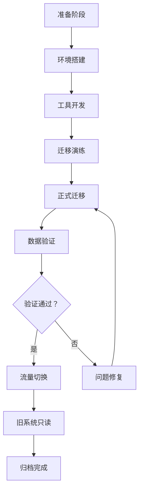
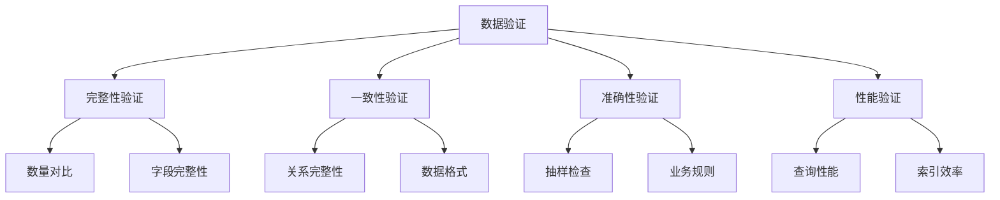

# 数据迁移执行方案

**版本**: 1.0  
**日期**: 2026-03-21  
**状态**: 📋 待执行

---

## 📋 执行摘要

### 迁移目标

将现有系统的所有核心业务数据完整、准确、安全地迁移到新系统，确保：
- ✅ **数据完整性**: 零数据丢失
- ✅ **数据一致性**: 关系完整，引用正确
- ✅ **数据准确性**: 转换正确，格式统一
- ✅ **业务连续性**: 迁移过程业务不中断或最小中断

### 迁移范围

| 数据类型 | 记录数 | 优先级 | 复杂度 |
|---------|--------|--------|--------|
| 产品数据 | ~500 | P0 | 高 |
| 产品分类 | ~50 | P0 | 中 |
| 客户数据 | ~1,000 | P0 | 中 |
| 订单数据 | ~200 | P0 | 高 |
| 文章内容 | ~100 | P1 | 低 |
| 图片资源 | ~2,000 | P0 | 中 |
| SEO 数据 | ~600 | P1 | 低 |

**总计**: ~4,450 条记录

---

## 🗺️ 一、数据迁移策略

### 1.1 迁移方法论

采用**双写 + 批量迁移 + 验证 + 切换**策略：



### 1.2 迁移阶段

#### Phase 1: 准备阶段 (Week 1)
- 数据审计和清理
- 迁移工具开发
- 迁移脚本编写
- 测试环境准备

#### Phase 2: 演练阶段 (Week 2)
- 第一次迁移演练
- 性能测试
- 问题收集和修复
- 迁移流程优化

#### Phase 3: 正式迁移 (Week 3)
- 完整数据迁移
- 数据验证
- 性能验证
- 安全检查

#### Phase 4: 切换阶段 (Week 4)
- 增量同步
- 最终验证
- 流量切换
- 监控告警

---

## 📊 二、数据映射规则

### 2.1 产品数据映射

#### 源数据结构

```javascript
// 旧系统 Product Schema
{
  _id: ObjectId,
  name: String,                    // 产品名称
  description: String,             // 产品描述
  category: ObjectId,              // 分类引用
  specifications: Object,          // 规格参数 { key: value }
  images: [String],                // 图片 URL 数组
  price: Number,                   // 价格
  stock: Number,                   // 库存
  status: String,                  // 状态：draft|published|archived
  createdAt: Date,
  updatedAt: Date
}
```

#### 目标数据结构

```javascript
// 新系统 Product Schema
{
  _id: String,                     // ObjectId 转 String
  name: String,                    // 保持不变
  slug: String,                    // 新增：URL 友好名称
  description: {
    short: String,                 // 新增：简短描述 (150 字)
    full: String                   // 完整描述
  },
  categoryId: String,              // 分类 ID
  specifications: [{               // 改为数组，支持分组
    group: String,                 // 规格组名
    items: [{
      key: String,
      value: String,
      unit: String
    }]
  }],
  media: {
    images: [{
      url: String,
      alt: String,
      width: Number,
      height: Number,
      size: Number,
      format: String
    }],
    videos: [{
      url: String,
      thumbnail: String,
      duration: Number
    }]
  },
  pricing: {
    basePrice: Number,
    currency: String,              // 默认 CNY
    taxRate: Number,               // 税率 0.13
    discountPrice: Number          // 折扣价
  },
  inventory: {
    quantity: Number,
    available: Boolean,
    warehouse: String,
    lowStockThreshold: Number      // 低库存阈值
  },
  seo: {
    title: String,
    description: String,
    keywords: [String],
    canonicalUrl: String
  },
  status: String,                  // draft|published|archived
  metadata: {
    createdAt: Date,
    updatedAt: Date,
    migratedAt: Date,              // 迁移时间
    migratedBy: String             // 迁移工具版本
  }
}
```

#### 字段转换规则

```typescript
// data-migration/src/mappings/product.mapping.ts

export const productFieldMapping = {
  // 直接映射
  _id: { source: '_id', transform: 'toString' },
  name: { source: 'name', transform: 'trim' },
  
  // 生成 slug
  slug: { 
    source: 'name', 
    transform: (name: string) => 
      name.toLowerCase()
        .replace(/[^a-z0-9]+/g, '-')
        .replace(/(^-|-$)/g, '')
  },
  
  // 描述拆分
  description: {
    source: 'description',
    transform: (desc: string) => ({
      short: desc.substring(0, 150) + (desc.length > 150 ? '...' : ''),
      full: desc
    })
  },
  
  // 分类引用
  categoryId: { source: 'category', transform: 'toString' },
  
  // 规格参数重组
  specifications: {
    source: 'specifications',
    transform: (specs: Record<string, any>) => {
      // 按类型分组
      const groups: Record<string, any[]> = {};
      
      Object.entries(specs).forEach(([key, value]) => {
        const group = getSpecGroup(key); // 根据 key 判断分组
        if (!groups[group]) {
          groups[group] = [];
        }
        groups[group].push({
          key,
          value: String(value),
          unit: getUnit(key) // 根据 key 获取单位
        });
      });
      
      return Object.entries(groups).map(([group, items]) => ({
        group,
        items
      }));
    }
  },
  
  // 图片增强
  media: {
    source: 'images',
    transform: async (imageUrls: string[]) => {
      const images = await Promise.all(
        imageUrls.map(async (url) => {
          const metadata = await getImageMetadata(url);
          return {
            url,
            alt: generateAltText(url),
            width: metadata.width,
            height: metadata.height,
            size: metadata.size,
            format: getFormat(url)
          };
        })
      );
      
      return { images, videos: [] };
    }
  },
  
  // 价格系统
  pricing: {
    source: 'price',
    transform: (price: number) => ({
      basePrice: price,
      currency: 'CNY',
      taxRate: 0.13,
      discountPrice: null
    })
  },
  
  // 库存系统
  inventory: {
    source: 'stock',
    transform: (stock: number) => ({
      quantity: stock,
      available: stock > 0,
      warehouse: 'default',
      lowStockThreshold: 10
    })
  },
  
  // SEO 数据
  seo: {
    source: ['name', 'description'],
    transform: (name: string, desc: string) => ({
      title: `${name} | 盛通达材料科技`,
      description: extractMetaDescription(desc),
      keywords: extractKeywords(desc),
      canonicalUrl: `/products/${generateSlug(name)}`
    })
  },
  
  // 状态保持不变
  status: { source: 'status' },
  
  // 元数据
  metadata: {
    transform: () => ({
      createdAt: source.createdAt,
      updatedAt: new Date(),
      migratedAt: new Date(),
      migratedBy: 'migration-tool-v1.0'
    })
  }
};
```

### 2.2 分类数据映射

```typescript
export const categoryMapping = {
  _id: { source: '_id', transform: 'toString' },
  name: { source: 'name', transform: 'trim' },
  slug: {
    source: 'name',
    transform: (name: string) => 
      name.toLowerCase()
        .replace(/[^a-z0-9]+/g, '-')
        .replace(/(^-|-$)/g, '')
  },
  parentId: { 
    source: 'parent',
    transform: (parent: ObjectId) => parent ? parent.toString() : null
  },
  level: {
    source: 'parent',
    transform: (parent: ObjectId) => parent ? 2 : 1
  },
  order: { source: 'order', default: 0 },
  description: { source: 'description', default: '' },
  productCount: {
    source: '_id',
    transform: async (id: ObjectId) => 
      await countProductsByCategory(id)
  },
  metadata: {
    transform: () => ({
      migratedAt: new Date(),
      migratedBy: 'migration-tool-v1.0'
    })
  }
};
```

### 2.3 客户数据映射

```typescript
export const customerMapping = {
  _id: { source: '_id', transform: 'toString' },
  email: { source: 'email', transform: 'toLowerCase' },
  name: { source: 'name', transform: 'trim' },
  company: { source: 'company', transform: 'trim' },
  phone: {
    source: 'phone',
    transform: (phone: string) => normalizePhone(phone)
  },
  role: { source: 'role', default: 'customer' },
  status: { source: 'status', default: 'active' },
  addresses: {
    source: 'addresses',
    transform: (addresses: any[]) => 
      addresses.map(addr => ({
        type: addr.type || 'shipping',
        name: addr.name,
        phone: normalizePhone(addr.phone),
        address: addr.address,
        city: addr.city,
        province: addr.province,
        country: addr.country || 'China',
        postalCode: addr.postalCode,
        isDefault: addr.isDefault || false
      }))
  },
  preferences: {
    source: 'preferences',
    transform: (prefs: any) => ({
      language: prefs?.language || 'zh',
      currency: prefs?.currency || 'CNY',
      newsletter: prefs?.newsletter || false
    })
  },
  lastLoginAt: { source: 'lastLoginAt' },
  metadata: {
    transform: (source: any) => ({
      createdAt: source.createdAt,
      updatedAt: new Date(),
      migratedAt: new Date(),
      migratedBy: 'migration-tool-v1.0'
    })
  }
};
```

### 2.4 订单数据映射

```typescript
export const orderMapping = {
  _id: { source: '_id', transform: 'toString' },
  orderNumber: { source: 'orderNumber' },
  customerId: { source: 'customer', transform: 'toString' },
  items: {
    source: 'items',
    transform: (items: any[]) =>
      items.map(item => ({
        productId: item.product.toString(),
        name: item.name,
        sku: item.sku,
        quantity: item.quantity,
        price: item.price,
        total: item.price * item.quantity
      }))
  },
  pricing: {
    source: ['subtotal', 'tax', 'shipping', 'total'],
    transform: (subtotal: number, tax: number, shipping: number, total: number) => ({
      subtotal,
      tax,
      shipping,
      discount: 0,
      total
    })
  },
  status: { source: 'status' },
  paymentStatus: { source: 'paymentStatus' },
  paymentMethod: { source: 'paymentMethod' },
  shippingAddress: {
    source: 'shippingAddress',
    transform: (addr: any) => ({
      name: addr.name,
      phone: normalizePhone(addr.phone),
      address: addr.address,
      city: addr.city,
      province: addr.province,
      country: addr.country,
      postalCode: addr.postalCode
    })
  },
  tracking: {
    source: 'tracking',
    transform: (tracking: any) => tracking || {
      carrier: null,
      trackingNumber: null,
      events: []
    }
  },
  metadata: {
    transform: (source: any) => ({
      createdAt: source.createdAt,
      updatedAt: new Date(),
      migratedAt: new Date(),
      migratedBy: 'migration-tool-v1.0'
    })
  }
};
```

---

## 🔧 三、迁移工具开发

### 3.1 工具架构

```
data-migration/
├── src/
│   ├── migrators/           # 迁移器
│   │   ├── base.migrator.ts    # 基础迁移器
│   │   ├── products.migrator.ts
│   │   ├── categories.migrator.ts
│   │   ├── customers.migrator.ts
│   │   └── orders.migrator.ts
│   ├── mappings/            # 映射规则
│   │   ├── product.mapping.ts
│   │   ├── category.mapping.ts
│   │   └── ...
│   ├── validators/          # 验证器
│   │   ├── data.validator.ts
│   │   ├── integrity.validator.ts
│   │   └── performance.validator.ts
│   ├── utils/               # 工具函数
│   │   ├── database.ts
│   │   ├── logger.ts
│   │   └── helpers.ts
│   └── index.ts
├── tests/
│   ├── migrators/
│   ├── mappings/
│   └── validators/
└── package.json
```

### 3.2 基础迁移器

```typescript
// src/migrators/base.migrator.ts

export abstract class BaseMigrator<TSource, TTarget> {
  protected sourceDb: MongoClient;
  protected targetDb: MongoClient;
  protected logger: Logger;
  protected batchSize: number = 100;

  constructor(sourceUri: string, targetUri: string) {
    this.sourceDb = connect(sourceUri);
    this.targetDb = connect(targetUri);
    this.logger = new Logger(this.constructor.name);
  }

  async migrate(): Promise<MigrationResult> {
    const result: MigrationResult = {
      success: true,
      total: 0,
      migrated: 0,
      failed: 0,
      errors: []
    };

    try {
      // 1. 获取源数据
      const sourceData = await this.getSourceData();
      result.total = sourceData.length;

      // 2. 分批处理
      const batches = this.chunkArray(sourceData, this.batchSize);
      
      for (const batch of batches) {
        const batchResult = await this.migrateBatch(batch);
        result.migrated += batchResult.success;
        result.failed += batchResult.failed;
        result.errors.push(...batchResult.errors);
        
        this.logger.info(
          `Batch completed: ${batchResult.success} success, ${batchResult.failed} failed`
        );
      }

      // 3. 创建索引
      await this.createIndexes();

      // 4. 验证数据
      const validation = await this.validate(result);
      if (!validation.passed) {
        result.success = false;
        result.errors.push(...validation.errors);
      }

    } catch (error) {
      result.success = false;
      result.errors.push({
        type: 'MIGRATION_ERROR',
        message: error.message
      });
      this.logger.error('Migration failed', error);
    }

    return result;
  }

  protected abstract getSourceData(): Promise<TSource[]>;
  protected abstract transform(source: TSource): Promise<TTarget>;
  protected abstract createIndexes(): Promise<void>;
  protected abstract validate(result: MigrationResult): Promise<ValidationResult>;

  private async migrateBatch(batch: TSource[]): Promise<BatchResult> {
    const result: BatchResult = { success: 0, failed: 0, errors: [] };

    for (const item of batch) {
      try {
        const transformed = await this.transform(item);
        await this.saveToTarget(transformed);
        result.success++;
      } catch (error) {
        result.failed++;
        result.errors.push({
          type: 'TRANSFORM_ERROR',
          message: error.message,
          data: item
        });
      }
    }

    return result;
  }

  private async saveToTarget(data: TTarget): Promise<void> {
    await this.targetDb.collection(this.getTargetCollection()).insertOne(data);
  }

  protected abstract getTargetCollection(): string;

  private chunkArray<T>(array: T[], size: number): T[][] {
    const chunks: T[][] = [];
    for (let i = 0; i < array.length; i += size) {
      chunks.push(array.slice(i, i + size));
    }
    return chunks;
  }
}
```

### 3.3 产品迁移器实现

```typescript
// src/migrators/products.migrator.ts

export class ProductMigrator extends BaseMigrator<SourceProduct, TargetProduct> {
  protected async getSourceData(): Promise<SourceProduct[]> {
    this.logger.info('Fetching products from source database');
    const products = await this.sourceDb
      .collection('products')
      .find({})
      .toArray();
    
    this.logger.info(`Found ${products.length} products`);
    return products;
  }

  protected async transform(source: SourceProduct): Promise<TargetProduct> {
    // 应用映射规则
    const target: TargetProduct = {
      _id: source._id.toString(),
      name: source.name.trim(),
      slug: this.generateSlug(source.name),
      description: {
        short: source.description.substring(0, 150),
        full: source.description
      },
      categoryId: source.category.toString(),
      specifications: this.transformSpecifications(source.specifications),
      media: await this.processImages(source.images),
      pricing: {
        basePrice: source.price,
        currency: 'CNY',
        taxRate: 0.13,
        discountPrice: null
      },
      inventory: {
        quantity: source.stock,
        available: source.stock > 0,
        warehouse: 'default',
        lowStockThreshold: 10
      },
      seo: {
        title: `${source.name} | 盛通达材料科技`,
        description: this.extractMetaDescription(source.description),
        keywords: this.extractKeywords(source.description),
        canonicalUrl: `/products/${this.generateSlug(source.name)}`
      },
      status: source.status,
      metadata: {
        createdAt: source.createdAt,
        updatedAt: new Date(),
        migratedAt: new Date(),
        migratedBy: 'migration-tool-v1.0'
      }
    };

    return target;
  }

  protected async createIndexes(): Promise<void> {
    this.logger.info('Creating indexes for products collection');
    
    const collection = this.targetDb.collection('products');
    
    // 创建索引
    await collection.createIndex({ slug: 1 }, { unique: true });
    await collection.createIndex({ categoryId: 1, status: 1 });
    await collection.createIndex({ 'seo.title': 1 });
    await collection.createIndex({ 'metadata.createdAt': -1 });
    await collection.createIndex({ name: 'text', description: 'text' });
    
    this.logger.info('Indexes created successfully');
  }

  protected async validate(result: MigrationResult): Promise<ValidationResult> {
    this.logger.info('Validating migrated products');
    
    const errors: ValidationError[] = [];
    
    // 1. 数量验证
    const sourceCount = result.total;
    const targetCount = await this.targetDb.collection('products').countDocuments();
    
    if (sourceCount !== targetCount) {
      errors.push({
        type: 'COUNT_MISMATCH',
        message: `Count mismatch: source ${sourceCount} vs target ${targetCount}`
      });
    }
    
    // 2. 抽样验证
    const sample = await this.targetDb.collection('products')
      .aggregate([{ $sample: { size: 50 } }])
      .toArray();
    
    for (const product of sample) {
      const validation = this.validateProduct(product);
      if (!validation.passed) {
        errors.push(...validation.errors);
      }
    }
    
    // 3. 关系验证
    const categories = await this.targetDb.collection('categories')
      .find({}, { projection: { _id: 1 } })
      .toArray();
    
    const categoryIds = new Set(categories.map(c => c._id));
    const productsWithInvalidCategory = await this.targetDb.collection('products')
      .find({ categoryId: { $nin: Array.from(categoryIds) } })
      .toArray();
    
    if (productsWithInvalidCategory.length > 0) {
      errors.push({
        type: 'INVALID_REFERENCE',
        message: `${productsWithInvalidCategory.length} products have invalid category references`
      });
    }
    
    return {
      passed: errors.length === 0,
      errors
    };
  }

  private validateProduct(product: TargetProduct): ValidationResult {
    const errors: ValidationError[] = [];
    
    // 必填字段
    if (!product.name) {
      errors.push({ field: 'name', message: 'Name is required' });
    }
    
    if (!product.slug) {
      errors.push({ field: 'slug', message: 'Slug is required' });
    }
    
    // 价格验证
    if (product.pricing.basePrice < 0) {
      errors.push({ field: 'price', message: 'Price cannot be negative' });
    }
    
    // 图片验证
    if (product.media.images.length === 0) {
      errors.push({ field: 'images', message: 'At least one image is required' });
    }
    
    return {
      passed: errors.length === 0,
      errors
    };
  }

  // 辅助函数
  private generateSlug(name: string): string {
    return name
      .toLowerCase()
      .replace(/[^a-z0-9]+/g, '-')
      .replace(/(^-|-$)/g, '');
  }

  private transformSpecifications(specs: Record<string, any>): any[] {
    // 实现规格参数分组逻辑
    // ...
  }

  private async processImages(urls: string[]): Promise<any> {
    // 实现图片处理逻辑
    // ...
  }

  private extractMetaDescription(description: string): string {
    // 实现元描述提取
    // ...
  }

  private extractKeywords(description: string): string[] {
    // 实现关键词提取
    // ...
  }

  protected getTargetCollection(): string {
    return 'products';
  }
}
```

---

## ✅ 四、验证流程

### 4.1 验证层次



### 4.2 完整性验证

```typescript
// src/validators/integrity.validator.ts

export class IntegrityValidator {
  async validateCompleteness(): Promise<ValidationResult> {
    const errors: ValidationError[] = [];

    // 1. 集合数量验证
    const collections = [
      'products',
      'categories',
      'customers',
      'orders',
      'articles'
    ];

    for (const collection of collections) {
      const sourceCount = await this.sourceDb.collection(collection).countDocuments();
      const targetCount = await this.targetDb.collection(collection).countDocuments();

      if (sourceCount !== targetCount) {
        errors.push({
          type: 'COUNT_MISMATCH',
          collection,
          message: `${collection}: source ${sourceCount} vs target ${targetCount}`
        });
      }
    }

    // 2. 必填字段验证
    const requiredFieldsValidation = await this.validateRequiredFields();
    errors.push(...requiredFieldsValidation.errors);

    // 3. 唯一性验证
    const uniqueValidation = await this.validateUniqueness();
    errors.push(...uniqueValidation.errors);

    return {
      passed: errors.length === 0,
      errors
    };
  }

  private async validateRequiredFields(): Promise<ValidationResult> {
    const errors: ValidationError[] = [];

    // 产品必填字段
    const productsWithMissingFields = await this.targetDb.collection('products')
      .find({
        $or: [
          { name: { $exists: false } },
          { slug: { $exists: false } },
          { categoryId: { $exists: false } }
        ]
      })
      .toArray();

    if (productsWithMissingFields.length > 0) {
      errors.push({
        type: 'MISSING_REQUIRED_FIELDS',
        collection: 'products',
        message: `${productsWithMissingFields.length} products missing required fields`
      });
    }

    return { passed: errors.length === 0, errors };
  }

  private async validateUniqueness(): Promise<ValidationResult> {
    const errors: ValidationError[] = [];

    // 验证 slug 唯一性
    const duplicateSlugs = await this.targetDb.collection('products')
      .aggregate([
        { $group: { _id: '$slug', count: { $sum: 1 } } },
        { $match: { count: { $gt: 1 } } }
      ])
      .toArray();

    if (duplicateSlugs.length > 0) {
      errors.push({
        type: 'DUPLICATE_VALUES',
        collection: 'products',
        message: `${duplicateSlugs.length} duplicate slugs found`
      });
    }

    return { passed: errors.length === 0, errors };
  }
}
```

### 4.3 一致性验证

```typescript
// src/validators/consistency.validator.ts

export class ConsistencyValidator {
  async validateConsistency(): Promise<ValidationResult> {
    const errors: ValidationError[] = [];

    // 1. 外键关系验证
    const foreignKeyValidation = await this.validateForeignKeys();
    errors.push(...foreignKeyValidation.errors);

    // 2. 数据格式验证
    const formatValidation = await this.validateDataFormats();
    errors.push(...formatValidation.errors);

    // 3. 业务规则验证
    const businessRuleValidation = await this.validateBusinessRules();
    errors.push(...businessRuleValidation.errors);

    return {
      passed: errors.length === 0,
      errors
    };
  }

  private async validateForeignKeys(): Promise<ValidationResult> {
    const errors: ValidationError[] = [];

    // 验证产品 - 分类关系
    const categoryIds = await this.getCategoryIds();
    const productsWithInvalidCategory = await this.targetDb.collection('products')
      .find({ categoryId: { $nin: categoryIds } })
      .toArray();

    if (productsWithInvalidCategory.length > 0) {
      errors.push({
        type: 'INVALID_FOREIGN_KEY',
        relation: 'products.categoryId -> categories._id',
        message: `${productsWithInvalidCategory.length} products reference non-existent categories`
      });
    }

    // 验证订单 - 客户关系
    const customerIds = await this.getCustomerIds();
    const ordersWithInvalidCustomer = await this.targetDb.collection('orders')
      .find({ customerId: { $nin: customerIds } })
      .toArray();

    if (ordersWithInvalidCustomer.length > 0) {
      errors.push({
        type: 'INVALID_FOREIGN_KEY',
        relation: 'orders.customerId -> customers._id',
        message: `${ordersWithInvalidCustomer.length} orders reference non-existent customers`
      });
    }

    return { passed: errors.length === 0, errors };
  }

  private async validateDataFormats(): Promise<ValidationResult> {
    const errors: ValidationError[] = [];

    // 验证邮箱格式
    const invalidEmails = await this.targetDb.collection('customers')
      .find({ email: { $not: /^[^\s@]+@[^\s@]+\.[^\s@]+$/ } })
      .toArray();

    if (invalidEmails.length > 0) {
      errors.push({
        type: 'INVALID_FORMAT',
        field: 'customer.email',
        message: `${invalidEmails.length} customers have invalid email format`
      });
    }

    // 验证价格格式
    const negativePrices = await this.targetDb.collection('products')
      .find({ 'pricing.basePrice': { $lt: 0 } })
      .toArray();

    if (negativePrices.length > 0) {
      errors.push({
        type: 'INVALID_FORMAT',
        field: 'product.price',
        message: `${negativePrices.length} products have negative prices`
      });
    }

    return { passed: errors.length === 0, errors };
  }

  private async validateBusinessRules(): Promise<ValidationResult> {
    const errors: ValidationError[] = [];

    // 验证库存逻辑
    const stockMismatch = await this.targetDb.collection('products')
      .find({
        'inventory.available': true,
        'inventory.quantity': { $lte: 0 }
      })
      .toArray();

    if (stockMismatch.length > 0) {
      errors.push({
        type: 'BUSINESS_RULE_VIOLATION',
        rule: 'available products must have quantity > 0',
        message: `${stockMismatch.length} products have stock inconsistency`
      });
    }

    return { passed: errors.length === 0, errors };
  }
}
```

### 4.4 验证报告

```typescript
// 生成验证报告
const validator = new DataValidator(sourceDb, targetDb);
const report = await validator.generateReport();

console.log('=== 数据迁移验证报告 ===');
console.log(`总体验证项：${report.totalChecks}`);
console.log(`通过：${report.passed}`);
console.log(`失败：${report.failed}`);
console.log(`警告：${report.warnings}`);
console.log('');
console.log('详细结果:');
report.results.forEach(result => {
  console.log(`[${result.passed ? '✅' : '❌'}] ${result.name}`);
  if (!result.passed) {
    result.errors.forEach(error => {
      console.log(`  - ${error.type}: ${error.message}`);
    });
  }
});
```

---

## 🚀 五、执行步骤

### 5.1 准备工作

```bash
# 1. 完整备份旧数据库
mongodump \
  --uri="mongodb://localhost:27017/stdmaterial" \
  --out="/backups/pre-migration-$(date +%Y%m%d-%H%M%S)"

# 2. 创建新数据库
mongosh --eval "
  use stdmaterial_v2;
  db.createCollection('products');
  db.createCollection('categories');
  db.createCollection('customers');
  db.createCollection('orders');
  db.createCollection('articles');
"

# 3. 准备迁移工具
cd data-migration
pnpm install
pnpm build

# 4. 配置环境变量
cp .env.example .env
# 编辑 .env 配置数据库连接
```

### 5.2 执行迁移

```bash
# 1. 迁移分类数据（优先，因为产品依赖分类）
pnpm run migrate:categories

# 2. 迁移产品数据
pnpm run migrate:products

# 3. 迁移客户数据
pnpm run migrate:customers

# 4. 迁移订单数据
pnpm run migrate:orders

# 5. 迁移文章内容
pnpm run migrate:articles

# 6. 迁移图片资源
pnpm run migrate:media
```

### 5.3 数据验证

```bash
# 1. 运行完整性验证
pnpm run validate:integrity

# 2. 运行一致性验证
pnpm run validate:consistency

# 3. 运行准确性验证
pnpm run validate:accuracy

# 4. 运行性能验证
pnpm run validate:performance

# 5. 生成完整报告
pnpm run validate:all --report
```

### 5.4 切换流量

```bash
# 1. 停止旧应用写入
pm2 stop stdmaterial-api

# 2. 最后一次增量同步
pnpm run migrate:delta

# 3. 最终验证
pnpm run validate:final

# 4. 切换环境变量
export DATABASE_URI="mongodb://localhost:27017/stdmaterial_v2"

# 5. 启动新应用
pm2 start stdmaterial-v2-api

# 6. 监控
pm2 monit
```

---

## 📊 六、迁移报告模板

```markdown
# 数据迁移报告

## 基本信息
- 迁移时间：2026-03-21 10:00 - 12:00
- 迁移工具版本：v1.0.0
- 操作人员：[姓名]

## 迁移统计

### 产品数据
- 源数据：500 条
- 目标数据：500 条
- 成功：500 条
- 失败：0 条
- 成功率：100%

### 分类数据
- 源数据：50 条
- 目标数据：50 条
- 成功：50 条
- 失败：0 条
- 成功率：100%

### 客户数据
- 源数据：1,000 条
- 目标数据：1,000 条
- 成功：1,000 条
- 失败：0 条
- 成功率：100%

### 订单数据
- 源数据：200 条
- 目标数据：200 条
- 成功：200 条
- 失败：0 条
- 成功率：100%

## 验证结果

### 完整性验证
✅ 所有集合数据量一致
✅ 必填字段完整
✅ 唯一性约束满足

### 一致性验证
✅ 外键关系正确
✅ 数据格式规范
✅ 业务规则符合

### 性能验证
✅ 查询响应时间 < 100ms
✅ 索引创建完成
✅ 数据库大小合理

## 问题汇总
无

## 结论
✅ 数据迁移成功，可以切换流量
```

---

**文档维护**: 技术部  
**最后更新**: 2026-03-21  
**下次审查**: 2026-04-21
