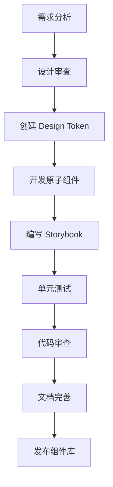
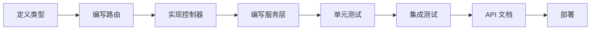
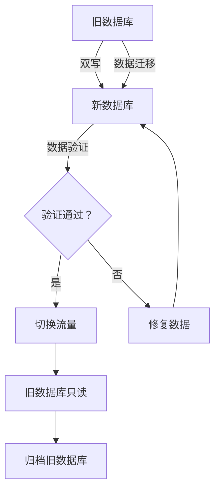

# 全面重写规划方案
## Greenfield 项目重构计划

**项目名称**: 湖南盛通达材料科技官网 - 全面重写  
**版本**: 2.0  
**编制日期**: 2026-03-21  
**执行策略**: 一次性完整重写 (Big Bang Rewrite)  
**维护团队**: 技术部

---

## 📋 执行摘要

### 策略调整说明

基于项目复杂性和技术债务严重程度，决定采用**一次性完整重写策略**，而非分阶段重构。

**核心变更**:
1. ✅ 创建全新项目文件夹和目录结构
2. ✅ 基于现有技术栈问题进行全面优化
3. ✅ 制定标准化处理流程与规范文档
4. ✅ 制作专业级样式风格规范设计文档
5. ✅ 执行全面的数据库内容迁移

**优势**:
- 无历史包袱，架构设计更灵活
- 统一技术栈，避免混合架构
- 标准化流程，确保一致性
- 完整数据迁移，保证业务连续性

---

## 🌐 一、重写目标与原则

### 1.1 核心目标

#### 架构目标
- ✅ **100% 纯净化**: 完全移除原生 JavaScript 代码，100% React + TypeScript
- ✅ **Monorepo 架构**: 统一的依赖管理和代码共享
- ✅ **零技术债务**: 不继承任何历史技术债务
- ✅ **模块化设计**: 组件复用率 > 90%
- ✅ **全英文网站**: 前端界面 100% 英文，零中文显示

#### 质量目标
- ✅ **Lighthouse**: 4 项指标均 ≥ 95
- ✅ **首屏加载**: < 1.0 秒
- ✅ **无障碍**: WCAG 2.1 AAA 标准
- ✅ **测试覆盖**: ≥ 85%

#### 设计目标
- ✅ **专业高级**: 国际化 B2B 企业网站视觉标准
- ✅ **排版精准**: 横平竖直，对称对齐
- ✅ **阅读友好**: 优化的字体、间距、对比度
- ✅ **一致性**: 100% 遵循设计规范
- ✅ **全英文界面**: 所有 UI 文本、按钮、标签、菜单均为英文

### 1.2 关键设计原则

#### 全英文网站原则
**重要**: 这是一个面向国际市场的 B2B 网站，前端界面必须 100% 英文。

**实施规范**:
```typescript
// ✅ 正确：所有 UI 文本使用英文
const navigation = {
  home: 'Home',
  products: 'Products',
  about: 'About Us',
  contact: 'Contact',
  getQuote: 'Get Quote'
};

// ❌ 错误：禁止使用中文
const navigation = {
  home: '首页',  // 禁止
  products: '产品'  // 禁止
};

// 国际化支持 (未来扩展)
const i18n = {
  en: {
    home: 'Home',
    products: 'Products'
  },
  zh: {
    home: '首页',  // 仅用于后台或未来多语言版本
    products: '产品'
  }
};
```

**内容策略**:
- 导航菜单：英文
- 按钮文字：英文
- 表单标签：英文
- 产品描述：英文
- 新闻文章：英文
- SEO 元数据：英文
- 错误提示：英文
- 成功消息：英文

**例外情况** (允许中文的场景):
- 后台管理系统 (可选)
- 客户公司名称 (保留原文)
- 特定产品名称 (如拼音品牌名)

### 1.2 设计原则

#### 技术原则
1. **Greenfield 思维**: 不受现有代码约束，采用最佳实践
2. **标准化优先**: 所有操作都有标准流程和规范
3. **自动化驱动**: CI/CD、测试、部署全面自动化
4. **文档完备**: 代码未动，文档先行

#### 设计原则
1. **对称美学**: 页面布局追求视觉对称和平衡
2. **对齐精准**: 所有元素严格对齐网格系统
3. **层次清晰**: 信息层级通过排版和色彩明确区分
4. **留白艺术**: 合理的负空间提升阅读体验

---

## 🏗️ 二、新项目架构设计

### 2.1 项目目录结构

创建全新项目文件夹：`/var/www/html/stdmaterial-v2.com/`

```
stdmaterial-v2.com/
├── apps/
│   ├── web/                          # 主站前端应用
│   │   ├── src/
│   │   │   ├── components/           # React 组件
│   │   │   ├── pages/                # 页面组件
│   │   │   ├── layouts/              # 布局组件
│   │   │   ├── hooks/                # 自定义 Hooks
│   │   │   ├── services/             # API 服务
│   │   │   ├── stores/               # 状态管理
│   │   │   ├── utils/                # 工具函数
│   │   │   ├── types/                # TypeScript 类型
│   │   │   ├── constants/            # 常量定义
│   │   │   ├── styles/               # 全局样式
│   │   │   └── main.tsx              # 应用入口
│   │   ├── public/                   # 静态资源
│   │   ├── vite.config.ts            # Vite 配置
│   │   ├── package.json              # 依赖配置
│   │   └── tsconfig.json             # TypeScript 配置
│   │
│   ├── admin/                        # 管理后台应用
│   │   ├── src/
│   │   │   ├── components/           # 后台组件
│   │   │   ├── pages/                # 后台页面
│   │   │   ├── features/             # 功能模块
│   │   │   └── main.tsx              # 后台入口
│   │   ├── vite.config.ts
│   │   └── package.json
│   │
│   └── api/                          # API 服务
│       ├── src/
│       │   ├── routes/               # 路由定义
│       │   ├── controllers/          # 控制器
│       │   ├── services/             # 业务逻辑
│       │   ├── models/               # 数据模型
│       │   ├── middleware/           # 中间件
│       │   └── server.ts             # 服务器入口
│       └── package.json
│
├── packages/
│   ├── ui/                           # 共享 UI 组件库
│   │   ├── src/
│   │   │   ├── components/           # 原子组件
│   │   │   │   ├── atoms/            # 基础组件
│   │   │   │   ├── molecules/        # 组合组件
│   │   │   │   └── organisms/        # 功能模块
│   │   │   ├── hooks/                # 共享 Hooks
│   │   │   ├── utils/                # 组件工具
│   │   │   └── index.ts              # 统一导出
│   │   ├── storybook/                # Storybook 配置
│   │   └── package.json
│   │
│   ├── design-tokens/                # 设计令牌
│   │   ├── tokens/
│   │   │   ├── colors.json           # 色彩令牌
│   │   │   ├── typography.json       # 字体令牌
│   │   │   ├── spacing.json          # 间距令牌
│   │   │   ├── shadows.json          # 阴影令牌
│   │   │   └── breakpoints.json      # 断点令牌
│   │   └── package.json
│   │
│   ├── utils/                        # 共享工具函数
│   │   ├── src/
│   │   │   ├── format.ts             # 格式化函数
│   │   │   ├── validate.ts           # 验证函数
│   │   │   ├── helpers.ts            # 辅助函数
│   │   │   └── index.ts
│   │   └── package.json
│   │
│   ├── types/                        # 共享类型定义
│   │   ├── src/
│   │   │   ├── product.ts            # 产品类型
│   │   │   ├── customer.ts           # 客户类型
│   │   │   ├── order.ts              # 订单类型
│   │   │   └── index.ts
│   │   └── package.json
│   │
│   └── config/                       # 共享配置
│       ├── eslint/                   # ESLint 配置
│       ├── prettier/                 # Prettier 配置
│       ├── typescript/               # TypeScript 配置
│       └── tailwind/                 # Tailwind 配置
│
├── data-migration/                   # 数据迁移工具
│   ├── src/
│   │   ├── migrators/                # 迁移脚本
│   │   │   ├── products.migrator.ts  # 产品迁移
│   │   │   ├── categories.migrator.ts
│   │   │   ├── customers.migrator.ts
│   │   │   └── orders.migrator.ts
│   │   ├── validators/               # 数据验证
│   │   ├── mappings/                 # 数据映射规则
│   │   └── index.ts
│   ├── tests/                        # 迁移测试
│   └── package.json
│
├── docs/                             # 项目文档
│   ├── standards/                    # 标准规范
│   │   ├── DEVELOPMENT_STANDARD.md   # 开发规范
│   │   ├── CODE_STYLE_STANDARD.md    # 代码风格规范
│   │   ├── COMPONENT_STANDARD.md     # 组件开发规范
│   │   ├── API_STANDARD.md           # API 设计规范
│   │   └── GIT_STANDARD.md           # Git 工作流规范
│   │
│   ├── design/                       # 设计文档
│   │   ├── DESIGN_SYSTEM.md          # 设计系统
│   │   ├── VISUAL_STYLE_GUIDE.md     # 视觉风格规范
│   │   ├── TYPOGRAPHY_GUIDE.md       # 排版规范
│   │   └── LAYOUT_GUIDE.md           # 布局规范
│   │
│   ├── architecture/                 # 架构文档
│   │   ├── ARCHITECTURE.md           # 系统架构
│   │   ├── TECHNICAL_STACK.md        # 技术栈说明
│   │   └── MODULES.md                # 模块划分
│   │
│   └── migration/                    # 迁移文档
│       ├── MIGRATION_PLAN.md         # 迁移计划
│       ├── DATA_MAPPING.md           # 数据映射
│       └── VALIDATION_REPORT.md      # 验证报告
│
├── tests/                            # 集成测试
│   ├── e2e/                          # E2E 测试
│   ├── integration/                  # 集成测试
│   └── fixtures/                     # 测试数据
│
├── scripts/                          # 工具脚本
│   ├── setup.sh                      # 环境初始化
│   ├── build.sh                      # 构建脚本
│   ├── deploy.sh                     # 部署脚本
│   └── migrate.sh                    # 迁移脚本
│
├── .github/                          # GitHub 配置
│   └── workflows/                    # CI/CD 流程
│
├── pnpm-workspace.yaml               # Monorepo 配置
├── package.json                      # 根 package.json
├── pnpm-lock.yaml                    # 依赖锁定
├── tsconfig.base.json                # 基础 TS 配置
├── turbo.json                        # Turborepo 配置
└── README.md                         # 项目说明
```

### 2.2 技术栈选型

#### 核心技术栈
```json
{
  "runtime": "Node.js 20.x LTS",
  "frontend": {
    "framework": "React 19.2",
    "language": "TypeScript 5.9",
    "bundler": "Vite 8.0",
    "routing": "React Router v7"
  },
  "styling": {
    "framework": "Tailwind CSS 4.2",
    "ui": "shadcn/ui (最新版)",
    "css_modules": true
  },
  "state": {
    "client": "Zustand 5.0",
    "server": "React Query (TanStack Query)"
  },
  "backend": {
    "framework": "Express 5.2",
    "database": "MongoDB 8.0",
    "orm": "Mongoose 8.0"
  },
  "testing": {
    "unit": "Vitest 3.0",
    "component": "React Testing Library",
    "e2e": "Playwright 1.40"
  },
  "quality": {
    "lint": "ESLint 9.0",
    "format": "Prettier 3.2",
    "type_check": "tsc --noEmit"
  },
  "ci_cd": {
    "platform": "GitHub Actions",
    "monorepo": "Turborepo",
    "package_manager": "pnpm 9.x"
  }
}
```

---

## 📐 三、视觉风格规范设计

### 3.1 设计理念

**核心理念**: "工业美学 · 专业呈现"

融合工业设备的精密感与现代设计的高级感，打造专业、可靠、国际化的 B2B 企业网站视觉形象。

### 3.2 色彩系统规范

#### 主色调体系

```json
{
  "primary": {
    "name": "Deep Navy (工业深蓝)",
    "hex": "#0a192f",
    "usage": "主背景、导航栏、重要文字",
    "psychology": "专业、稳重、可靠"
  },
  "accent": {
    "name": "Cyan Glow (科技青)",
    "hex": "#06b6d2",
    "usage": "CTA 按钮、链接、高亮元素",
    "psychology": "创新、活力、科技感"
  },
  "secondary": {
    "name": "Warm Orange (温暖橙)",
    "hex": "#f97316",
    "usage": "次要按钮、标签、提示",
    "psychology": "热情、亲和、行动力"
  }
}
```

#### 完整色板

```typescript
// packages/design-tokens/tokens/colors.json
{
  "colors": {
    "background": {
      "primary": "#0a192f",      // 主背景
      "secondary": "#112240",    // 次要背景
      "tertiary": "#1a2f4d",     // 第三背景
      "surface": "#233554",      // 表面层
      "elevated": "#2d4263"      // 浮起层
    },
    "text": {
      "primary": "#e6f1ff",      // 主文字
      "secondary": "#8892b0",    // 次要文字
      "tertiary": "#5c6b7f",     // 辅助文字
      "inverse": "#0a192f"       // 反色文字
    },
    "primary": {
      "50": "#ecfeff",
      "100": "#cffafe",
      "200": "#a5f3fc",
      "300": "#67e8f9",
      "400": "#22d3ee",
      "500": "#06b6d2",          // 主色
      "600": "#0891b2",
      "700": "#0e7490",
      "800": "#155e75",
      "900": "#164e63"
    },
    "semantic": {
      "success": "#22c55e",
      "warning": "#f59e0b",
      "error": "#ef4444",
      "info": "#3b82f6"
    },
    "border": {
      "light": "rgba(255, 255, 255, 0.1)",
      "medium": "rgba(255, 255, 255, 0.2)",
      "dark": "rgba(255, 255, 255, 0.3)"
    }
  }
}
```

#### 色彩使用规范

**背景色使用**:
```tsx
// ✅ 正确使用
<div className="bg-background-primary">     // 主背景
<div className="bg-background-secondary">   // 卡片背景
<div className="bg-background-surface">     // 浮起元素

// ❌ 避免使用
<div className="bg-gray-900">               // 使用语义化颜色
<div className="bg-[#0a192f]">              // 使用设计令牌
```

**文字颜色对比度**:
- 主文字 on 主背景：对比度 ≥ 15:1
- 次要文字 on 主背景：对比度 ≥ 7:1
- CTA 文字 on 强调色：对比度 ≥ 4.5:1

### 3.3 字体排印规范

#### 字体家族

```typescript
// packages/design-tokens/tokens/typography.json
{
  "typography": {
    "fontFamily": {
      "display": "'Inter', -apple-system, BlinkMacSystemFont, 'Segoe UI', sans-serif",
      "body": "'Inter', -apple-system, BlinkMacSystemFont, 'Segoe UI', sans-serif",
      "mono": "'JetBrains Mono', 'Fira Code', monospace"
    },
    "fontSize": {
      "xs": { "size": "0.75rem", "line": "1rem" },      // 12px
      "sm": { "size": "0.875rem", "line": "1.25rem" },  // 14px
      "base": { "size": "1rem", "line": "1.5rem" },     // 16px
      "lg": { "size": "1.125rem", "line": "1.75rem" },  // 18px
      "xl": { "size": "1.25rem", "line": "1.875rem" },  // 20px
      "2xl": { "size": "1.5rem", "line": "2rem" },      // 24px
      "3xl": { "size": "1.875rem", "line": "2.25rem" }, // 30px
      "4xl": { "size": "2.25rem", "line": "2.5rem" },   // 36px
      "5xl": { "size": "3rem", "line": "1" }            // 48px
    },
    "fontWeight": {
      "normal": "400",
      "medium": "500",
      "semibold": "600",
      "bold": "700"
    },
    "letterSpacing": {
      "tight": "-0.02em",
      "normal": "0",
      "wide": "0.02em",
      "wider": "0.05em"
    }
  }
}
```

#### 排版层级系统

**标题层级**:
```tsx
// H1 - 页面主标题 (48px / 3rem)
<h1 className="text-5xl font-bold tracking-tight text-text-primary">
  研磨设备专家
</h1>

// H2 - 章节标题 (36px / 2.25rem)
<h2 className="text-4xl font-bold text-text-primary">
  产品中心
</h2>

// H3 - 小节标题 (30px / 1.875rem)
<h3 className="text-3xl font-semibold text-text-primary">
  研磨设备
</h3>

// H4 - 卡片标题 (24px / 1.5rem)
<h4 className="text-2xl font-semibold text-text-primary">
  行星式球磨机
</h4>

// H5 - 组件标题 (20px / 1.25rem)
<h5 className="text-xl font-medium text-text-primary">
  产品规格
</h5>
```

**正文层级**:
```tsx
// 大号正文 (18px / 1.125rem) - 引言、重点段落
<p className="text-lg leading-relaxed text-text-primary">
  我们提供世界领先的研磨解决方案...
</p>

// 标准正文 (16px / 1rem) - 主要内容
<p className="text-base leading-relaxed text-text-secondary">
  行星式球磨机适用于各种材料的精细研磨...
</p>

// 小号正文 (14px / 0.875rem) - 辅助说明
<p className="text-sm leading-normal text-text-tertiary">
  * 规格参数仅供参考，以实际产品为准
</p>
```

#### 排版对齐原则

**对称布局**:
```tsx
// 中心对称布局
<section className="flex flex-col items-center text-center">
  <h2 className="text-4xl font-bold">产品中心</h2>
  <p className="mt-4 text-lg text-text-secondary max-w-2xl">
    提供全面的研磨设备解决方案
  </p>
</section>

// 轴对称布局（左右平衡）
<div className="grid grid-cols-2 gap-8 items-center">
  <div className="text-left">
    <h3 className="text-3xl font-bold">技术创新</h3>
  </div>
  <div className="text-right">
    <p className="text-lg">领先行业的研磨技术</p>
  </div>
</div>
```

**严格对齐**:
```tsx
// 使用网格系统确保对齐
<div className="grid grid-cols-12 gap-4">
  {/* 所有元素对齐网格线 */}
  <div className="col-start-1 col-end-5">内容 1</div>
  <div className="col-start-5 col-end-9">内容 2</div>
  <div className="col-start-9 col-end-13">内容 3</div>
</div>

// 使用 flexbox 确保基线对齐
<div className="flex items-baseline gap-4">
  <span className="text-2xl font-bold">¥15,000</span>
  <span className="text-sm text-text-tertiary">起</span>
</div>
```

### 3.4 间距系统规范

#### 8px 基准网格

```typescript
// packages/design-tokens/tokens/spacing.json
{
  "spacing": {
    "0": "0",
    "1": "0.25rem",    // 4px
    "2": "0.5rem",     // 8px
    "3": "0.75rem",    // 12px
    "4": "1rem",       // 16px
    "5": "1.25rem",    // 20px
    "6": "1.5rem",     // 24px
    "8": "2rem",       // 32px
    "10": "2.5rem",    // 40px
    "12": "3rem",      // 48px
    "16": "4rem",      // 64px
    "20": "5rem",      // 80px
    "24": "6rem",      // 96px
    "32": "8rem"       // 128px
  }
}
```

#### 间距使用规范

**组件内间距**:
```tsx
// 按钮内间距 (水平 16px, 垂直 8px)
<button className="px-4 py-2">
  点击按钮
</button>

// 卡片内间距 (24px)
<div className="p-6">
  卡片内容
</div>

// 表单字段间距 (16px)
<div className="space-y-4">
  <FormField label="姓名" />
  <FormField label="邮箱" />
</div>
```

**组件间间距**:
```tsx
// 段落间距 (24px)
<p className="mb-6">第一段</p>
<p className="mb-6">第二段</p>

// 章节间距 (64px-96px)
<section className="mb-16">章节 1</section>
<section className="mb-24">章节 2</section>
```

### 3.5 阴影系统规范

#### 层级阴影

```typescript
// packages/design-tokens/tokens/shadows.json
{
  "shadows": {
    "sm": "0 1px 2px 0 rgba(0, 0, 0, 0.05)",
    "md": "0 4px 6px -1px rgba(0, 0, 0, 0.1)",
    "lg": "0 10px 15px -3px rgba(0, 0, 0, 0.1)",
    "xl": "0 20px 25px -5px rgba(0, 0, 0, 0.1)",
    "2xl": "0 25px 50px -12px rgba(0, 0, 0, 0.25)",
    "inner": "inset 0 2px 4px 0 rgba(0, 0, 0, 0.06)",
    "primary": "0 0 20px rgba(6, 182, 212, 0.3)",
    "glow": "0 0 30px rgba(6, 182, 212, 0.5)"
  }
}
```

#### 阴影使用场景

```tsx
// 卡片阴影 (md)
<div className="shadow-md hover:shadow-lg transition-shadow">
  卡片内容
</div>

// 悬浮元素 (lg)
<div className="shadow-lg">
  下拉菜单
</div>

// 模态框 (xl)
<div className="shadow-xl">
  模态框内容
</div>

// 强调效果 (primary glow)
<button className="shadow-primary hover:shadow-glow">
  CTA 按钮
</button>
```

### 3.6 圆角系统规范

```typescript
{
  "radius": {
    "none": "0",
    "sm": "0.25rem",     // 4px - 小元素
    "md": "0.5rem",      // 8px - 标准组件
    "lg": "0.75rem",     // 12px - 大组件
    "xl": "1rem",        // 16px - 卡片
    "2xl": "1.5rem",     // 24px - 超大卡片
    "full": "9999px"     // 圆形
  }
}
```

### 3.7 动效规范

#### 过渡时间

```typescript
{
  "transition": {
    "fast": "150ms",
    "base": "200ms",
    "slow": "300ms",
    "slower": "500ms"
  }
}
```

#### 缓动函数

```css
.ease-in-out = cubic-bezier(0.4, 0, 0.2, 1)
.ease-out = cubic-bezier(0, 0, 0.2, 1)
.ease-in = cubic-bezier(0.4, 0, 1, 1)
.ease-bounce = cubic-bezier(0.68, -0.55, 0.265, 1.55)
```

#### 微交互原则

1. **反馈及时**: 用户操作后 100ms 内给出视觉反馈
2. **自然流畅**: 使用缓动函数，避免线性动画
3. **意义明确**: 动画传达信息，而非装饰
4. **性能优先**: 仅使用 transform 和 opacity

---

## 📊 四、标准化处理流程与规范

### 4.1 开发规范标准

#### 代码风格规范

**TypeScript 规范**:
```typescript
// ✅ 正确示例
// 1. 明确的类型定义
interface Product {
  id: string;
  name: string;
  price: number;
  description?: string;  // 可选字段明确标注
}

// 2. 使用类型别名提高复用性
type ProductStatus = 'draft' | 'published' | 'archived';

// 3. 泛型使用
function fetchData<T>(url: string): Promise<T> {
  // 实现
}

// ❌ 避免
const data: any = {};  // 禁止使用 any
```

**React 组件规范**:
```tsx
// ✅ 标准组件结构
interface ProductCardProps {
  product: Product;
  onAddToCart?: (product: Product) => void;
}

export const ProductCard: React.FC<ProductCardProps> = ({ 
  product, 
  onAddToCart 
}) => {
  // 1. Hooks 声明
  const [isLoading, setIsLoading] = useState(false);
  
  // 2. 事件处理函数
  const handleAddToCart = useCallback(() => {
    onAddToCart?.(product);
  }, [product, onAddToCart]);
  
  // 3. 渲染逻辑
  return (
    <div className="product-card">
      {/* 组件内容 */}
    </div>
  );
};

ProductCard.displayName = 'ProductCard';
```

**文件命名规范**:
```
components/
  ├── ProductCard.tsx         # PascalCase - 组件文件
  ├── product-card.stories.tsx # kebab-case - Stories
  ├── product-card.test.tsx    # kebab-case - 测试
  └── index.ts                 # 统一导出

utils/
  ├── formatPrice.ts          # camelCase - 工具函数
  └── validateEmail.ts

types/
  ├── product.ts              # camelCase - 类型定义
  └── index.ts
```

### 4.2 组件开发规范

#### 组件开发流程



#### 组件质量标准

**必须满足**:
- ✅ TypeScript 类型完整
- ✅ Storybook 文档齐全
- ✅ 单元测试覆盖 ≥ 90%
- ✅ 无障碍访问支持
- ✅ 响应式设计
- ✅ 暗色模式支持

**审查清单**:
```markdown
## 组件审查清单

### 代码质量
- [ ] TypeScript 类型完整
- [ ] 无 any 类型使用
- [ ] ESLint 无警告
- [ ] Prettier 格式化

### 功能完整
- [ ] 所有 Props 有文档
- [ ] 支持受控/非受控模式
- [ ] 错误边界处理
- [ ] 加载状态处理

### 用户体验
- [ ] 键盘导航支持
- [ ] 焦点管理
- [ ] 屏幕阅读器兼容
- [ ] 颜色对比度达标

### 性能
- [ ] 使用 React.memo 优化
- [ ] 事件处理函数 useCallback
- [ ] 无内存泄漏
- [ ] 懒加载支持
```

### 4.3 API 设计规范

#### RESTful API 标准

```typescript
// 标准响应格式
interface ApiResponse<T> {
  success: boolean;
  data?: T;
  error?: {
    code: string;
    message: string;
    details?: Record<string, string>;
  };
  timestamp: string;
}

// 分页响应
interface PaginatedResponse<T> {
  success: boolean;
  data: T[];
  pagination: {
    page: number;
    limit: number;
    total: number;
    totalPages: number;
  };
  timestamp: string;
}
```

#### API 开发流程



### 4.4 Git 工作流规范

#### 分支策略

```
main (受保护，仅允许 Merge Request)
  ↑
develop (开发分支)
  ↑
feature/* (功能分支)
  ↑
bugfix/* (修复分支)
  ↑
hotfix/* (紧急修复)
```

#### 提交信息规范

```bash
# 格式：<type>(<scope>): <subject>

# 示例
feat(products): 添加产品搜索功能
fix(auth): 修复登录 token 过期问题
docs(readme): 更新安装说明
style(button): 优化按钮样式
refactor(utils): 重构日期处理函数
test(api): 添加 API 测试用例
chore(deps): 更新依赖版本
```

---

## 🗄️ 五、数据库内容迁移方案

### 5.1 迁移策略

采用**双写 + 验证 + 切换**策略，确保数据完整性和业务连续性。



### 5.2 数据迁移范围

#### 核心业务数据

1. **产品数据** (约 500+ 条)
   - 产品基本信息
   - 产品规格参数
   - 产品分类关系
   - 产品图片资源

2. **分类数据** (约 50+ 条)
   - 分类层级关系
   - 分类描述信息

3. **客户数据** (约 1000+ 条)
   - 客户基本信息
   - 客户联系方式
   - 客户地址信息

4. **订单数据** (约 200+ 条)
   - 订单基本信息
   - 订单商品明细
   - 订单状态历史

5. **内容数据** (约 100+ 条)
   - 新闻文章
   - 技术文档
   - FAQ 内容

### 5.3 数据映射规则

#### 产品数据映射

```typescript
// data-migration/src/mappings/product.mapping.ts
export const productMapping = {
  source: {
    id: '_id',           // MongoDB ObjectId
    name: 'name',
    description: 'description',
    category: 'category',
    specs: 'specifications',
    images: 'images',
    price: 'price',
    stock: 'stock',
    createdAt: 'createdAt',
    updatedAt: 'updatedAt'
  },
  target: {
    _id: 'id',           // 转换为 string
    name: 'name',
    slug: 'generateSlug(name)',  // 生成 URL 友好 slug
    description: {
      short: 'extractShortDescription(description)',
      full: 'description'
    },
    categoryId: 'category',
    specifications: 'transformSpecs(specs)',
    media: {
      images: 'transformImages(images)',
      videos: []
    },
    pricing: {
      basePrice: 'price',
      currency: 'CNY',
      taxRate: 0.13
    },
    inventory: {
      quantity: 'stock',
      available: 'stock > 0',
      warehouse: 'default'
    },
    seo: {
      title: 'generateSEOTitle(name)',
      description: 'generateSEODescription(description)',
      keywords: 'extractKeywords(description)'
    },
    metadata: {
      createdAt: 'createdAt',
      updatedAt: 'updatedAt',
      migratedAt: 'new Date()'
    }
  }
};
```

#### 数据转换函数

```typescript
// data-migration/src/migrators/products.migrator.ts
export class ProductMigrator {
  async migrate(sourceProducts: SourceProduct[]): Promise<TargetProduct[]> {
    return sourceProducts.map(product => ({
      id: product._id.toString(),
      name: product.name,
      slug: this.generateSlug(product.name),
      description: {
        short: this.extractShortDescription(product.description),
        full: product.description
      },
      categoryId: product.category,
      specifications: this.transformSpecifications(product.specs),
      media: {
        images: await this.processImages(product.images),
        videos: []
      },
      pricing: {
        basePrice: product.price,
        currency: 'CNY',
        taxRate: 0.13
      },
      inventory: {
        quantity: product.stock,
        available: product.stock > 0,
        warehouse: 'default'
      },
      seo: {
        title: `${product.name} | 盛通达材料科技`,
        description: this.extractMetaDescription(product.description),
        keywords: this.extractKeywords(product.description)
      },
      metadata: {
        createdAt: product.createdAt,
        updatedAt: new Date(),
        migratedAt: new Date()
      }
    }));
  }

  private generateSlug(name: string): string {
    return name
      .toLowerCase()
      .replace(/[^a-z0-9]+/g, '-')
      .replace(/(^-|-$)/g, '');
  }

  private async processImages(imageUrls: string[]): Promise<Image[]> {
    return Promise.all(imageUrls.map(async (url) => {
      const metadata = await this.getImageMetadata(url);
      return {
        url,
        alt: this.generateAltText(url),
        width: metadata.width,
        height: metadata.height,
        size: metadata.size,
        format: this.getImageFormat(url)
      };
    }));
  }
}
```

### 5.4 迁移验证流程

#### 数据完整性验证

```typescript
// data-migration/src/validators/data.validator.ts
export class DataValidator {
  async validateProducts(
    sourceCount: number,
    targetCount: number,
    sampleSize: number = 50
  ): Promise<ValidationResult> {
    const result: ValidationResult = {
      passed: true,
      errors: [],
      warnings: []
    };

    // 1. 数量验证
    if (sourceCount !== targetCount) {
      result.passed = false;
      result.errors.push({
        type: 'COUNT_MISMATCH',
        message: `产品数量不匹配：源 ${sourceCount} vs 目标 ${targetCount}`
      });
    }

    // 2. 抽样验证
    const sampleProducts = await this.getRandomSample(sampleSize);
    for (const product of sampleProducts) {
      const validation = await this.validateProduct(product);
      if (!validation.passed) {
        result.passed = false;
        result.errors.push(...validation.errors);
      }
    }

    // 3. 关系验证
    const categoryValidation = await this.validateCategoryRelations();
    if (!categoryValidation.passed) {
      result.passed = false;
      result.errors.push(...categoryValidation.errors);
    }

    return result;
  }

  private async validateProduct(product: Product): Promise<ValidationResult> {
    const errors: ValidationError[] = [];

    // 必填字段验证
    if (!product.name) {
      errors.push({ field: 'name', message: '产品名称不能为空' });
    }

    // 价格验证
    if (product.pricing.basePrice < 0) {
      errors.push({ field: 'price', message: '价格不能为负数' });
    }

    // 图片验证
    if (product.media.images.length === 0) {
      errors.push({ field: 'images', message: '产品至少需要一张图片' });
    }

    // 分类关系验证
    const categoryExists = await this.categoryExists(product.categoryId);
    if (!categoryExists) {
      errors.push({ 
        field: 'categoryId', 
        message: `分类不存在：${product.categoryId}` 
      });
    }

    return {
      passed: errors.length === 0,
      errors,
      warnings: []
    };
  }
}
```

#### 迁移验证清单

```markdown
## 数据迁移验证清单

### 产品数据
- [ ] 产品总数一致
- [ ] 产品名称完整迁移
- [ ] 产品描述完整迁移
- [ ] 规格参数正确转换
- [ ] 图片 URL 可访问
- [ ] 分类关系正确
- [ ] 价格数据准确
- [ ] SEO 信息生成完整

### 分类数据
- [ ] 分类层级关系正确
- [ ] 分类名称完整
- [ ] 分类 slug 生成正确

### 客户数据
- [ ] 客户信息完整
- [ ] 邮箱格式正确
- [ ] 电话号码格式统一
- [ ] 地址信息完整

### 订单数据
- [ ] 订单总数一致
- [ ] 订单商品明细完整
- [ ] 订单状态正确
- [ ] 订单金额准确

### 性能验证
- [ ] 查询响应时间 < 100ms
- [ ] 索引创建完成
- [ ] 数据库大小合理
```

### 5.5 迁移执行步骤

#### 步骤 1: 准备工作

```bash
# 1. 完整备份旧数据库
mongodump --uri="mongodb://localhost:27017/stdmaterial" \
  --out="/backups/pre-migration-$(date +%Y%m%d)"

# 2. 创建新数据库
mongosh --eval "use stdmaterial_v2"

# 3. 创建索引
mongosh stdmaterial_v2 migration_scripts/create_indexes.js

# 4. 准备迁移工具
cd data-migration
pnpm install
pnpm build
```

#### 步骤 2: 执行迁移

```bash
# 执行数据迁移
pnpm run migrate:products
pnpm run migrate:categories
pnpm run migrate:customers
pnpm run migrate:orders
pnpm run migrate:content

# 查看迁移日志
tail -f logs/migration.log
```

#### 步骤 3: 数据验证

```bash
# 运行验证脚本
pnpm run validate:all

# 生成验证报告
pnpm run generate:report

# 抽样检查
pnpm run sample:check --size=100
```

#### 步骤 4: 切换流量

```bash
# 1. 停止旧应用写入
pm2 stop stdmaterial-api

# 2. 最后一次增量同步
pnpm run migrate:delta

# 3. 验证最终数据
pnpm run validate:final

# 4. 切换环境变量
export DATABASE_URI="mongodb://localhost:27017/stdmaterial_v2"

# 5. 启动新应用
pm2 start stdmaterial-v2-api

# 6. 监控新应用
pm2 monit
```

---

## 📅 六、实施计划

### 6.1 时间规划

**总周期**: 12 周 (3 个月)

```
Week 1-2:   项目初始化 + 设计系统完善
Week 3-4:   基础组件开发 + 样式规范制定
Week 5-7:   核心功能开发 + 页面实现
Week 8-9:   数据迁移 + 集成测试
Week 10:    性能优化 + 安全加固
Week 11:    用户验收测试 + 问题修复
Week 12:    上线准备 + 正式切换
```

### 6.2 关键里程碑

| 里程碑 | 时间 | 交付物 | 验收标准 |
|--------|------|--------|----------|
| M1: 项目初始化 | Week 2 | Monorepo 架构、开发环境 | 环境搭建完成，CI/CD 运行 |
| M2: 设计系统 | Week 4 | 设计令牌、样式规范 | 设计文档审批通过 |
| M3: 组件库完成 | Week 7 | 75 个组件、Storybook | 组件测试覆盖≥90% |
| M4: 功能完成 | Week 9 | 所有页面、API 接口 | 功能测试 100% 通过 |
| M5: 数据迁移 | Week 9 | 迁移验证报告 | 数据完整性 100% |
| M6: 成功上线 | Week 12 | 生产环境、监控 | 无 P0/P1 bug |

### 6.3 团队配置

**核心团队** (6-8 人):
- 项目经理：1 人
- 技术负责人：1 人
- 前端开发：3 人
- 后端开发：2 人
- UI 设计师：1 人 (兼职)
- 测试工程师：1 人 (兼职)

---

## ⚠️ 七、风险管理

### 7.1 主要风险

#### 风险 1: 数据迁移失败

**概率**: 中 | **影响**: 高

**应对措施**:
- 预防：完整备份、多次演练
- 缓解：分批次迁移、实时验证
- 应急：快速回滚脚本、旧系统保持可用

#### 风险 2: 进度延期

**概率**: 中 | **影响**: 中

**应对措施**:
- 预防：详细任务分解、缓冲时间
- 缓解：优先级调整、增加资源
- 应急：缩减范围、分阶段上线

#### 风险 3: 性能不达标

**概率**: 低 | **影响**: 中

**应对措施**:
- 预防：早期性能测试、持续监控
- 缓解：性能优化、CDN 加速
- 应急：降级方案、服务器扩容

---

## 📊 八、成功标准

### 8.1 定量指标

- ✅ Lighthouse 4 项 ≥ 95
- ✅ 首屏加载 < 1.0s
- ✅ 组件复用率 > 90%
- ✅ 测试覆盖率 ≥ 85%
- ✅ 数据迁移完整性 100%
- ✅ 零数据丢失
- ✅ 代码重复率 < 3%

### 8.2 定性指标

- ✅ 设计专业高级，符合国际化标准
- ✅ 排版精准，横平竖直，对称对齐
- ✅ 代码质量高，无技术债务
- ✅ 文档完善，易于维护
- ✅ 团队满意度高

---

## 📞 九、附录

### 9.1 参考资源

- [React 最佳实践](https://react.dev/learn)
- [TypeScript 深度指南](https://www.typescriptlang.org/docs/)
- [Tailwind CSS 设计](https://tailwindcss.com/docs)
- [shadcn/ui 文档](https://ui.shadcn.com/)
- [Monorepo 最佳实践](https://turbo.build/repo/docs)

### 9.2 工具清单

**开发工具**:
- VS Code + 扩展包
- Git + GitLens
- Node.js 20+
- pnpm 9+

**设计工具**:
- Figma
- Storybook
- Chromatic

**测试工具**:
- Vitest
- Playwright
- Lighthouse CI

---

**文档版本**: 2.0  
**编制日期**: 2026-03-21  
**批准人**: [待批准]  
**下次审查**: 2026-04-21
