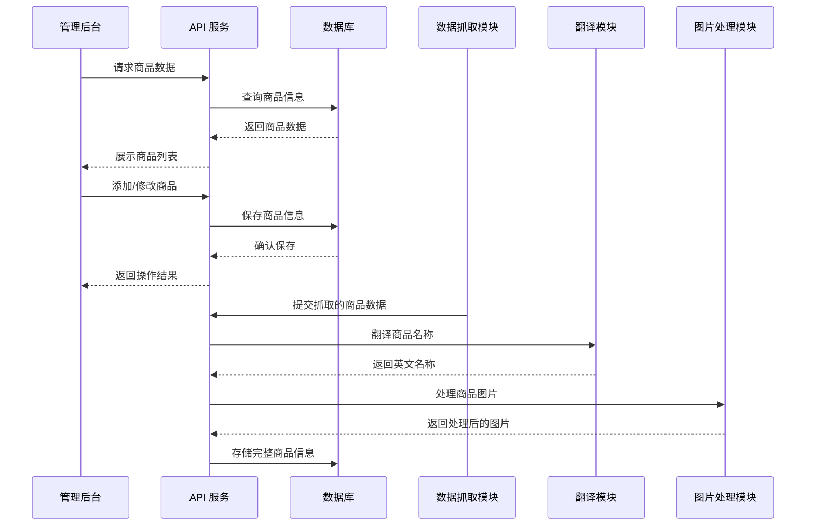

# 电商管理后台实施方案

## 1. 项目背景

当前产品索引系统存在不规范问题，使用产品名称作为索引，不符合标准化管理要求。需要开发专业的电商管理后台，实现商品管理界面、标准化产品索引体系，并对所有产品进行重新处理。

## 2. 技术栈选择

### 2.1 前端技术栈
- **框架**: React 19.2.4
- **语言**: TypeScript 5.9.3
- **构建工具**: Vite 8.0.0
- **样式**: Tailwind CSS 4.2.1
- **状态管理**: React Context API
- **HTTP 客户端**: Axios 1.13.6

### 2.2 后端技术栈
- **框架**: Express.js 5.2.1
- **语言**: Node.js
- **数据库**: MongoDB (新增)
- **认证**: JWT (新增)
- **文件存储**: 本地文件系统

### 2.3 第三方服务
- **翻译服务**: Google Cloud Translation API (新增)
- **图片处理**: Sharp (新增)
- **爬虫**: Puppeteer (新增)

## 3. 架构设计

### 3.1 系统架构



### 3.2 目录结构

```
stdmaterial.com/
├── admin/                    # 管理后台前端
│   ├── src/
│   │   ├── components/       # 组件
│   │   ├── pages/            # 页面
│   │   ├── services/         # API 服务
│   │   └── utils/            # 工具函数
│   ├── index.html
│   ├── vite.config.js
│   └── package.json
├── src/                      # 主站前端
│   ├── routes/               # API 路由
│   ├── models/               # 数据模型
│   ├── services/             # 业务逻辑
│   └── utils/                # 工具函数
├── config/                   # 配置文件
├── public/                   # 静态资源
├── assets/                   # 资源文件
│   └── images/               # 图片存储
├── package.json
└── server.js                 # 服务器入口
```

## 4. 标准化产品索引体系设计

### 4.1 产品索引结构

| 字段名 | 类型 | 描述 | 示例 |
|-------|------|------|------|
| `productId` | String | 唯一产品ID (UUID) | "prod-12345678-1234-1234-1234-1234567890ab" |
| `sku` | String | 产品SKU (唯一) | "STD-PBM-001" |
| `name` | String | 产品名称 (中文) | "行星球磨机" |
| `nameEn` | String | 产品名称 (英文) | "Planetary Ball Mill" |
| `slug` | String | 产品URL友好路径 | "planetary-ball-mill" |
| `category` | String | 产品类别 | "grinding-series" |
| `categoryEn` | String | 产品类别 (英文) | "Grinding Series" |
| `description` | String | 产品描述 (中文) | "高效、精密的实验室级粉体制备设备" |
| `descriptionEn` | String | 产品描述 (英文) | "Efficient, precise laboratory-level powder preparation equipment" |
| `price` | Number | 产品价格 | 9999 |
| `images` | Array<String> | 产品图片URL数组 | ["/assets/images/..."] |
| `specs` | Object | 产品规格参数 | {"capacity": "5L", "power": "1.5kW"} |
| `status` | String | 产品状态 | "active" |
| `createdAt` | Date | 创建时间 | 2026-03-21T00:00:00Z |
| `updatedAt` | Date | 更新时间 | 2026-03-21T00:00:00Z |

### 4.2 索引优化策略

1. **主索引**: 基于 `productId` 的唯一索引
2. **SKU索引**: 基于 `sku` 的唯一索引
3. **类别索引**: 基于 `category` 的复合索引
4. **搜索索引**: 基于 `name`、`nameEn`、`description`、`descriptionEn` 的全文搜索索引
5. **价格索引**: 基于 `price` 的范围索引

## 5. 电商管理后台功能设计

### 5.1 核心功能

1. **商品管理**
   - 商品列表展示
   - 商品添加
   - 商品编辑
   - 商品删除
   - 商品批量操作

2. **分类管理**
   - 分类列表
   - 分类添加
   - 分类编辑
   - 分类删除

3. **数据抓取**
   - 从 sbworld.cn 抓取商品数据
   - 自动翻译商品名称
   - 自动处理商品图片

4. **系统设置**
   - 用户管理
   - 系统配置
   - 日志管理

### 5.2 界面设计

- **布局**: 左侧固定导航栏 + 右侧内容区
- **响应式**: 支持桌面端和平板设备
- **主题**: 深色主题，符合现有网站风格
- **交互**: 流畅的表单操作和数据展示

## 6. 数据抓取与处理流程

### 6.1 抓取流程

1. **网站分析**: 分析 sbworld.cn 的页面结构和数据格式
2. **数据抓取**: 使用 Puppeteer 抓取商品列表和详情页
3. **数据解析**: 提取商品名称、描述、图片等信息
4. **数据清洗**: 去除重复数据，标准化数据格式

### 6.2 翻译流程

1. **中文提取**: 从抓取的商品数据中提取中文文本
2. **API调用**: 调用 Google Cloud Translation API 进行翻译
3. **结果处理**: 处理翻译结果，确保准确性
4. **数据存储**: 将英文翻译结果存储到数据库

### 6.3 图片处理流程

1. **图片下载**: 从源网站下载商品图片
2. **图片优化**: 压缩图片大小，调整分辨率
3. **格式转换**: 统一转换为 WebP 格式
4. **存储管理**: 存储到本地文件系统，生成访问URL

## 7. 实施计划

### 7.1 阶段划分

| 阶段 | 任务 | 时间估计 |
|------|------|----------|
| 阶段1 | 系统架构设计与数据库搭建 | 3天 |
| 阶段2 | 后端API开发 | 5天 |
| 阶段3 | 管理后台前端开发 | 7天 |
| 阶段4 | 数据抓取模块开发 | 4天 |
| 阶段5 | 翻译与图片处理模块开发 | 3天 |
| 阶段6 | 系统集成与测试 | 3天 |
| 阶段7 | 数据迁移与验证 | 2天 |

### 7.2 关键时间节点

- **启动日期**: 2026-03-22
- **后端API完成**: 2026-03-29
- **前端开发完成**: 2026-04-05
- **模块开发完成**: 2026-04-12
- **系统测试完成**: 2026-04-15
- **数据迁移完成**: 2026-04-17
- **项目验收**: 2026-04-18

## 8. 质量验收标准

### 8.1 功能验收

1. **商品管理功能**
   - 能够成功添加、编辑、删除商品
   - 商品列表展示正确，支持分页和搜索
   - 批量操作功能正常

2. **数据抓取功能**
   - 能够成功从 sbworld.cn 抓取商品数据
   - 抓取的数据完整，无缺失
   - 抓取过程稳定，无异常中断

3. **翻译功能**
   - 中文产品名能够准确翻译为英文
   - 翻译结果符合专业术语规范
   - 翻译速度快，无明显延迟

4. **图片处理功能**
   - 商品图片能够正确下载和存储
   - 图片优化效果明显，加载速度快
   - 图片显示清晰，无失真

### 8.2 性能验收

1. **响应时间**
   - 页面加载时间 < 2秒
   - API响应时间 < 500ms
   - 数据抓取速度 > 10个商品/分钟

2. **稳定性**
   - 系统连续运行24小时无故障
   - 并发处理能力 > 50用户同时在线
   - 数据抓取过程中无内存泄漏

3. **安全性**
   - 后台登录需要身份验证
   - API接口有访问控制
   - 数据传输使用HTTPS

## 9. 风险评估与应对策略

### 9.1 潜在风险

1. **数据抓取限制**
   - 源网站可能有反爬虫机制
   - 抓取速度过快可能被封禁IP

2. **翻译质量**
   - 专业术语翻译可能不准确
   - 翻译API调用可能有配额限制

3. **图片处理**
   - 图片下载失败或丢失
   - 图片处理过程中出现错误

4. **系统集成**
   - 模块间接口不兼容
   - 数据格式不一致

### 9.2 应对策略

1. **数据抓取**
   - 实现智能爬虫，模拟人类行为
   - 设置合理的抓取间隔
   - 实现IP轮换机制

2. **翻译质量**
   - 建立专业术语词典
   - 人工审核重要商品的翻译结果
   - 备用翻译API方案

3. **图片处理**
   - 实现图片下载重试机制
   - 建立图片备份系统
   - 监控图片处理过程

4. **系统集成**
   - 制定统一的API接口规范
   - 实现数据格式验证
   - 建立完善的错误处理机制

## 10. 结论

本实施方案通过开发专业的电商管理后台，实现了标准化的产品索引体系，解决了当前系统的不规范问题。同时，通过数据抓取、翻译和图片处理模块，实现了对现有产品数据的标准化处理。

方案采用了现代化的技术栈，具有良好的可扩展性和维护性。通过合理的阶段划分和时间规划，确保了项目能够按时完成并达到预期的质量标准。

实施过程中，将严格遵循质量验收标准，确保系统的功能完整性、性能稳定性和安全性。同时，针对潜在风险制定了相应的应对策略，确保项目的顺利进行。